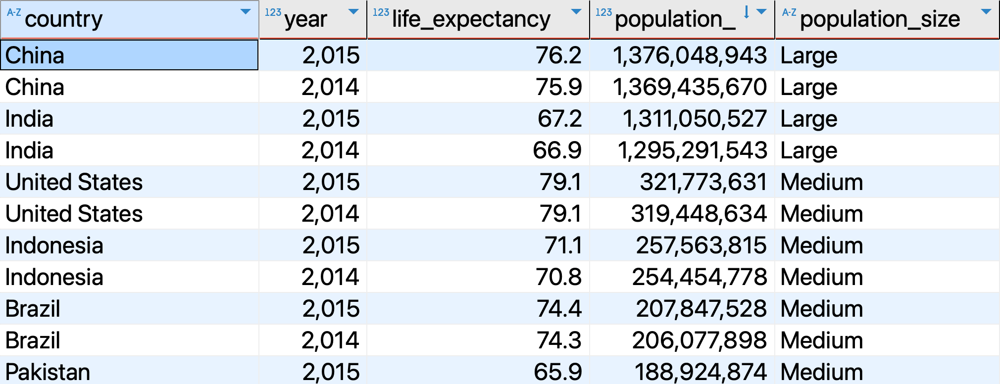

# `CASE WHEN` in SQL
In this file, you will learn how to use the `CASE WHEN` statement in SQL to create new columns based on conditions.

## Table of Contents
- [`CASE WHEN` in SQL](#case-when-in-sql)
  - [Table of Contents](#table-of-contents)
  - [What is CASE WHEN?](#what-is-case-when)
  - [Syntax](#syntax)
  - [Example](#example)
  - [Conclusion](#conclusion)
  - [Resources](#resources)

<hr style="border:2px solid black"> </hr>


## What is CASE WHEN?
The `CASE WHEN` statement is a conditional expression that allows you to create a new column based on a condition. It is similar to the `IF` statement in other programming languages.

## Syntax
The syntax of the `CASE WHEN` statement is as follows:

```sql
SELECT column1, column2, column3, 
       CASE 
           WHEN condition1 THEN result1
           WHEN condition2 THEN result2
           WHEN ... THEN ...
           ELSE result3
       END AS new_column
FROM table_name;
```
**Explanation**:
- `column1, column2, column3`: the columns you want to select.
- `condition1, condition2`: the conditions to be evaluated.
- `result1, result2`: the results to be returned if the conditions are met.
- `new_column`: the name of the new column.
- `table_name`: the name of the table you are querying. 
- `ELSE result3`: the result to be returned if none of the conditions are met.
- `END`: the end of the `CASE WHEN` statement.

## Example

Let's consider the table `life_exp_pop` from the `gapminder` schema. The table has columns `country`, `year`, `life_expectancy`, and `population_`. You want to create a new column called `population_size` based on the population of each country. You can use the `CASE WHEN` statement as follows:
```sql
SELECT country, year, life_expectancy, population_,
    -- Create a new column population_size based on the population
       CASE
           -- If population is greater than 1 billion, assign 'Large'
           WHEN population_ > 1000000000 THEN 'Large'
           -- If population is greater than 100 million, assign 'Medium'
           WHEN population_ > 100000000 THEN 'Medium'
            -- Otherwise, assign 'Small'
           ELSE 'Small'
        -- Name the new column as population_size
       END AS population_size
FROM life_exp_pop; 
```

In this example, the `population_size` column is created based on the population of each country. If the population is greater than 1 billion, the value is set to 'Large'. If the population is greater than 100 million, the value is set to 'Medium'. Otherwise, the value is set to 'Small'.

<p align="center">
<div style="display: inline-block; background-color: violet; padding: 10px; border-radius: 5px;\">
  
</div>
  <br>
  <em style="display: block; text-align: center;">CASE WHEN</em>
</p>

## Conclusion
The `CASE WHEN` statement is a tool in SQL that  you can use to create new columns based on conditions. It is useful for data transformation and analysis.

## Resources
- [PostgreSQL Documentation on CASE](https://www.postgresql.org/docs/17/functions-conditional.html)
- [W3Schools SQL Tutorial on CASE](https://www.w3schools.com/sql/sql_case.asp)