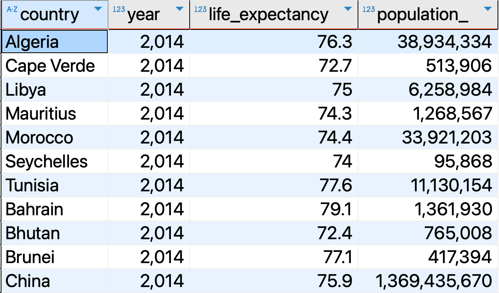
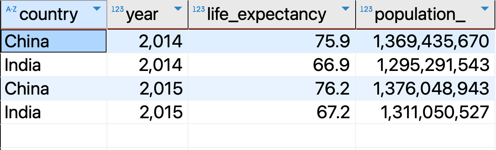
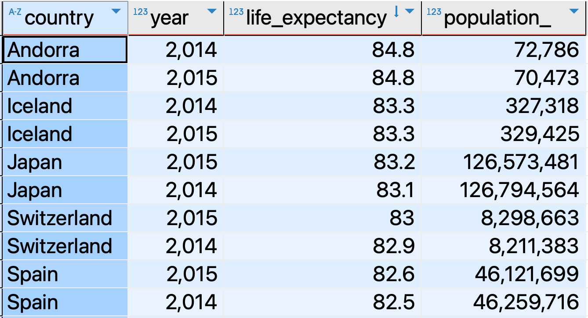
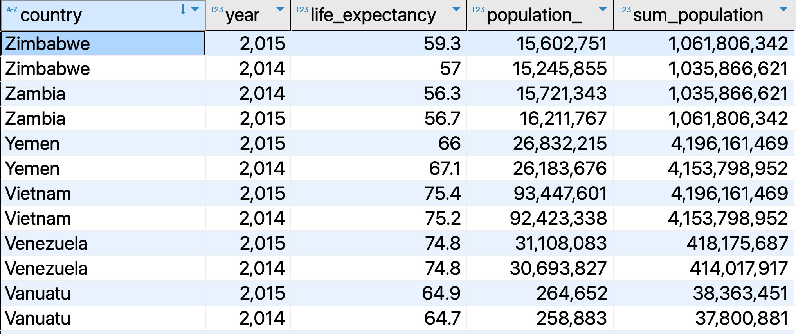

# `Subqueries`
In this file, we will learn how to use subqueries in SQL to create more complex queries.

## Table of Contents
- [`Subqueries`](#subqueries)
  - [Table of Contents](#table-of-contents)
  - [What is a Subquery?](#what-is-a-subquery)
  - [Subquery in the `WHERE` clause](#subquery-in-the-where-clause)
  - [Subquery in the `FROM` clause](#subquery-in-the-from-clause)
  - [Subquery in the `SELECT` clause](#subquery-in-the-select-clause)
  - [Subquery in the `HAVING` clause](#subquery-in-the-having-clause)
  - [Best Practices for SQL Subqueries](#best-practices-for-sql-subqueries)
  - [Conclusion](#conclusion)
  - [Resources](#resources)
  
<hr style="border:2px solid black"> </hr>

## What is a Subquery?
A subquery is a query nested within another query. You can use subqueries to filter, sort, or aggregate data based on the results of another query.
Subqueries can be used in the `SELECT`, `FROM`, `WHERE`, `HAVING`, and `JOIN` clauses and can **return** a **single value**, a **single row**, **multiple rows**, or a **table**. 
They are sourrounded by parentheses `()` and can be used with comparison operators such as `=`, `>`, `<`, `IN`, `NOT IN`, etc.


## Subquery in the `WHERE` clause
Let's consider the `life_exp_pop` table from the `gapminder` schema. The table has columns `country`, `year`, `life_expectancy`, and `population_`. Suppose you want to find the countries with a life expectancy in 2014 greater than the average life expectancy. You can use a subquery as follows:

```sql
SELECT country, year, life_expectancy, population_
FROM life_exp_pop
WHERE year = 2014 and life_expectancy > (
    -- Subquery to calculate the average life expectancy of year 2014
    SELECT AVG(life_expectancy) 
    FROM life_exp_pop
    WHERE year = 2014);
```
Let's understand the query:
1. The subquery `(SELECT AVG(life_expectancy) FROM life_exp_pop WHERE year = 2014)` returns just a single value, the average life expectancy of the year 2014.
2. The main query then selects the countries with a life expectancy greater than the average life expectancy of the year 2014.

<p align="center">
<div style="display: inline-block; background-color: violet; padding: 10px; border-radius: 5px;">
  
</div>
    <br>
    <em style="display: block; text-align: center;">Subquery in WHERE Clause</em>
</p>


Let's complicate the query a bit more by considering the average life expectancy for each year:

```sql
SELECT country, year, life_expectancy, population_
FROM life_exp_pop as outer_query
WHERE life_expectancy > (
    -- Subquery to calculate the average life expectancy
    SELECT AVG(life_expectancy) 
    FROM life_exp_pop as inner_query
    -- Condition to match the years
    WHERE inner_query.year = outer_query.year
    GROUP BY year);
```
In this case within the subquery we use the `GROUP BY` clause to group the results by year and also the `WHERE` clause to match the years between the outer and inner queries.

Let's consider another example in which in the subquery we use `WHERE` in combination with `IN` operator:
```sql
SELECT country, year, life_expectancy, population_
FROM life_exp_pop
WHERE country IN (
    -- Subquery to get the countries with a population greater than 1 billion
    SELECT country
    FROM life_exp_pop
    WHERE population_ > 1000000000);
```
In this case the subquery returns a list of countries with a population greater than 1 billion. The main query then selects the columns from the table for these countries.

<p align="center">
<div style="display: inline-block; background-color: violet; padding: 10px; border-radius: 5px;">
  
</div>
    <br>
    <em style="display: block; text-align: center;">Subquery in WHERE Clause</em>

## Subquery in the `FROM` clause
```sql
SELECT country, year, life_expectancy, population_ 
FROM (
    -- Subquery to get the countries with a life expectancy greater than 80
    SELECT country, year, life_expectancy, population_
    FROM life_exp_pop
    WHERE life_expectancy > 80) AS subquery;
```
In this case, the subquery returns a table with the countries with a life expectancy greater than 80. The main query then selects the columns from this table.

<p align="center">
<div style="display: inline-block; background-color: violet; padding: 10px; border-radius: 5px;">
  
</div>
    <br>
    <em style="display: block; text-align: center;">Subquery in FROM Clause</em>
</p>

## Subquery in the `SELECT` clause

```sql
SELECT 
    country, 
    year, 
    life_expectancy, 
    population_,
    -- Subquery to get the sum of the population for each region and year
    (SELECT SUM(l_inner.population_)
     FROM life_exp_pop AS l_inner
     WHERE l_inner.year = life_exp_pop.year
       AND l_inner.region = life_exp_pop.region) AS sum_population
FROM life_exp_pop;
```

In this case, the subquery calculates the sum of the population for each region and year. The main query then selects the columns from the table and includes the sum of the population for each region and year.
<p align="center">  
<div style="display: inline-block; background-color: violet; padding: 10px; border-radius: 5px;">
  
</div>
    <br>
    <em style="display: block; text-align: center;">Subquery in SELECT Clause</em>
</p>

## Subquery in the `HAVING` clause
```sql
SELECT region, AVG(life_expectancy) AS avg_life_exp
FROM life_exp_pop
GROUP BY region, year
HAVING AVG(life_expectancy) > (
    -- Subquery to calculate the overall average life expectancy
    SELECT AVG(life_expectancy)
    FROM life_exp_pop);
```
In this case, the subquery calculates the overall average life expectancy. The main query groups the data by region and year and calculates the average life expectancy for each group. The `HAVING` clause filters the groups with an average life expectancy greater than the overall average life expectancy.


## Best Practices for SQL Subqueries
+ **Performance Optimization**: Avoid unnecessary nested levels, as they can degrade query performance.
+ **Testing and Validation**: Test subqueries to ensure they return the correct data before integrating them into queries.
+ **Simplicity and Clarity**: Keep subqueries as simple and clear as possible. Too complex subqueries can be hard to maintain and debug.
+ **Alternatives to Subqueries**: Use other SQL features like `JOIN`, `CTE`, or `Window Functions` when possible to achieve the same result.

## Conclusion
We have learned how to use subqueries in SQL to create more complex queries. 

## Resources
- [PostgreSQL Documentation on Subqueries](https://www.postgresql.org/docs/current/functions-subquery.html)
- [W3Resource SQL Subqueries](https://www.w3resource.com/sql/subqueries/understanding-sql-subqueries.php)

