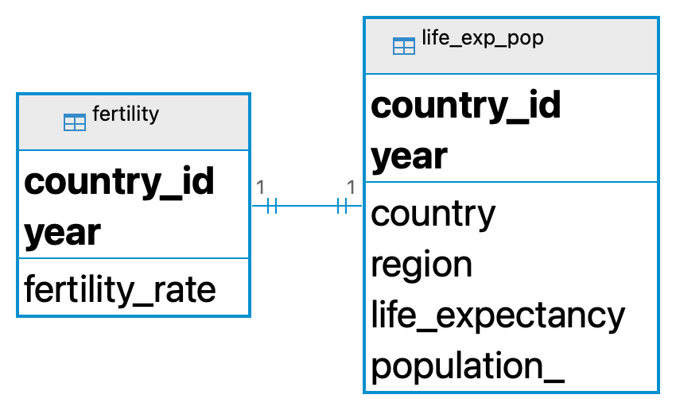

# Common Table Expressions (CTEs) IN SQL

As an alternative to subqueries, **Common Table Expressions (CTEs)** provide a way to simplify complex queries and improve readability.In this file, we will explore the benefits of using CTEs in SQL, how to create them, and when to use them.

## Table of Contents
- [Common Table Expressions (CTEs) IN SQL](#common-table-expressions-ctes-in-sql)
  - [Table of Contents](#table-of-contents)
  - [What is a SQL CTE](#what-is-a-sql-cte)
  - [How to Create a SQL CTE](#how-to-create-a-sql-cte)
  - [Why SQL CTEs Are Useful](#why-sql-ctes-are-useful)
    - [Make Complex Queries Easier to Read](#make-complex-queries-easier-to-read)
    - [Code Reusability](#code-reusability)
    - [Multilevel Aggregations](#multilevel-aggregations)
  - [Limitations of CTEs in SQL](#limitations-of-ctes-in-sql)
  - [CTEs vs Subqueries](#ctes-vs-subqueries)
  - [Conclusion](#conclusion)
  - [Resources:](#resources)

<hr style="border:2px solid black"> </hr>
   

## What is a SQL CTE
A CTE (Common Table Expression) is a **temporary**, **named result set** in SQL that we can use to simplify **complex queries**, making them easier to read and maintain.

It is essentially a table that is created on the fly and exists only for the duration of the query. It is not stored in the database.

We can think of it as a Python variable. When we create a variable in Python, we give it a name and it is stored in memory and is available for use until the program ends. Similarly, when we create a CTE in SQL, it is stored in memory and is available for use until the query ends.


## How to Create a SQL CTE

When creating a CTE, we use the keyword `WITH` to start the CTE definition. The general syntax of a CTE is as follows:

```sql 
WITH cte_name (column1, column2, ...)
AS (
    -- Query that defines the CTE
    SELECT ...
    FROM ...
    WHERE ...
)
-- Main query
SELECT ...
FROM cte_name;
```

Where:

- **WITH**: Initiates the CTE definition and indicates that the following name represents a temporary result set.
- **cte_name**: The name assigned to the CTE for referencing in the main query.
- **Optional column list (column1, column2, ...)**: Specifies the column names for the result set of the CTE. This is useful if the column names need to be customized.
- **Query that defines the CTE**: The inner query that selects data and forms the temporary result set.
- **Main query**: References the CTE by its name and uses it like a table.
<hr style="border:2px solid black"> </hr>

**Example**: 
Let's consider the two tables `fertility` and `life_exp_pop`, represented as in the **Entity Relationship Diagram** (ERD) below:
<p align="center">
<div style="display: inline-block; background-color: violet; padding: 10px; border-radius: 5px;">
  
</div>
    <br>
    <em style="display: block; text-align: center;">ERD</em>
</p>


We want to create a **CTE** that selects countries with a `life expectancy` above 70 years. We then want to use this **CTE** to select the `country`, `life expectancy`, and `population_` columns from the **CTE**.


**Step 1️⃣**: **Write the base query**

We start by writing the query that define the **CTE**:

```sql
SELECT country, life_expectancy, population_
FROM life_exp_pop
WHERE life_expectancy > 70;
```

**Step 2️⃣**: **Enclose the query with the keyword `WITH` to create a CTE**

Use the keyword `WITH` to give the **CTE** a name.

```sql
WITH HighLifeExpectancy AS (
    -- Query that defines the CTE
    SELECT country, life_expectancy, population_
    FROM life_exp_pop
    WHERE life_expectancy > 70
)  
```

**Step 3️⃣**: **Use the CTE in the main query**

Finally, you reference the **CTE** in a `SELECT` statement by calling the **CTE** name defined above.

```sql
-- Define a Common Table Expression (CTE)
WITH HighLifeExpectancy AS (
    -- Query that defines the CTE
    SELECT country, life_expectancy, population_
    FROM life_exp_pop
    WHERE life_expectancy > 70
)  

-- Use the CTE to select columns from the CTE
SELECT country_name, life_exp, pop
FROM HighLifeExpectancy;
```

To summarize the above steps, we used the keyword `WITH` to define the **CTE** named **`HighLifeExpectancy`**. The inner query was used to create the temporary dataset. The main query references the **`HighLifeExpectancy`** to display the specified columns `country_name`, `life_exp`, and `pop` from the **CTE**.

## Why SQL CTEs Are Useful
The above example is a simple illustration of how to create and use a **CTE** in SQL. Now, let's explore the benefits of using **CTEs** in SQL queries.


### Make Complex Queries Easier to Read

With **CTEs**, you can break down complex queries into smaller, more manageable parts, making the code easier to read, write, and maintain. This is especially useful when dealing with multiple joins, aggregations, or subqueries.


**Example**:

Suppose we want determine the average life expectancy and fertility rate by year and region for countries with a population greater than 50 million and show the result only for the year 2015. Without a CTE, the query looks cluttered and is hard to read and understand.
We need to join the tables on country_id and year, filter the data based on the population and year, and calculate the average life expectancy and fertility rate.

```sql
SELECT lep.region, avg(lep.life_expectancy) AS avg_life_exp, 
avg(f.fertility_rate) AS avg_fer_rate, lep.year
FROM life_exp_pop AS lep
JOIN fertility AS f 
ON lep.country_id = f.country_id AND lep.year = f.YEAR
WHERE lep.population_ < 50000000
GROUP BY lep.region, lep.year
HAVING lep.YEAR = 2015;
```

Using a **CTE**, we can break down the query into logical steps, making it easier to understand and maintain.

```sql
-- Define the CTE
WITH FilteredData AS (
    SELECT lep.region, lep.life_expectancy, f.fertility_rate, lep.year
    FROM life_exp_pop AS lep
    JOIN fertility AS f 
    ON lep.country_id = f.country_id AND lep.year = f.YEAR
    WHERE lep.population_ < 5000000
)

-- Main query
SELECT region, avg(life_expectancy) AS avg_life_exp,
avg(fertility_rate) AS avg_fer_rate, year
From FilteredData
GROUP BY region, year
HAVING year = 2015;
```

### Code Reusability

With **CTEs** we don't have to repeat the same calculations or operations multiple times in a query.

Suppose we need to calculate the total population and average life expectancy for each region in the `life_exp_pop` table for **year** 2014. We can use a **CTE** to define the calculations once and reuse them in subsequent queries.

```sql
-- Define a CTE to calculate total population and average life expectancy for each region
WITH RegionStats AS (
    SELECT region, SUM(population_) AS total_population, AVG(life_expectancy) AS avg_life_exp
    FROM life_exp_pop
    WHERE year = 2014
    GROUP BY region
)
-- Select region, total population, and average life expectancy from the CTE
SELECT region, total_population, avg_life_exp
FROM RegionStats
WHERE total_population > 500000000;
```

### Multilevel Aggregations
With **CTEs**, you can perform multilevel aggregations, such as calculating summary statistics at different granularities. Each **CTE** can calculate aggregations at each level, and then you can combine the results in the final query.

```sql
WITH CombinedData AS (
    -- Step 1: Join life expectancy and fertility rate data on country_id and year
    SELECT
        lep.country,
        lep.year,
        lep.life_expectancy,
        fr.fertility_rate
    FROM
        life_exp_pop as lep
    JOIN fertility as fr 
    ON lep.country_id = fr.country_id AND lep.year = fr.year
),
CountryAverages AS (
    -- Step 2: Calculate average life expectancy and fertility rate for each country
    SELECT
        country,
        AVG(life_expectancy) AS Avg_Life_Expectancy,
        AVG(fertility_rate) AS Avg_Fertility_Rate
    FROM
        CombinedData
    GROUP BY
        country
),
GlobalAverages AS (
    -- Step 3: Calculate global averages for life expectancy
    SELECT
        AVG(Avg_Life_Expectancy) AS Global_Avg_Life_Expectancy
    FROM
        CountryAverages
)
-- Step 4: Select countries with above-average life expectancy
SELECT
    ca.country,
    ca.Avg_Life_Expectancy,
    ca.Avg_Fertility_Rate,
    ga.Global_Avg_Life_Expectancy
FROM
    CountryAverages ca
-- Cross join with GlobalAverages to get global average life expectancy
CROSS JOIN
    GlobalAverages ga
WHERE
    ca.Avg_Life_Expectancy > ga.Global_Avg_Life_Expectancy;
```

The above query is divided into four steps:
1. **CombinedData**: Joins the life expectancy and fertility rate data.
2. **CountryAverages**: Calculates the average life expectancy and fertility rate for each country.
3. **GlobalAverages**: Calculates the global average life expectancy.
4. The **final** query selects countries with an above-average life expectancy, directly using the results from the previous CTEs.


## Limitations of CTEs in SQL
+ **Temporary Scope**: a **CTE** exists only for the duration of the query in which it is defined. Once the query execution is complete, the **CTE** is no longer available.
+ **Performance Issues**: For very large datasets, as the **CTE** is re-evaluated each time it is referenced, it may impact performance. In such cases, other solution like [**materialized views**](https://en.wikipedia.org/wiki/Materialized_view) may be more suitable.


## CTEs vs Subqueries

| Feature | CTEs | Subqueries |
|-----------|------------|---------------|
| **Definition** | Named temporary result sets that you can reference within a `SELECT`, `INSERT`, `UPDATE`, or `DELETE` statement. | Inline queries used within another query, often nested inside `WHERE` or `SELECT` statements |
|**Reusibility**| Can be reused multiple times within the same query after their declaration. | Can only be used once; each subquery must be rewritten if used multiple times.|
| **Readability** | Generally improves readability by breaking down complex queries into simpler, named parts. | Can reduce readability when deeply nested or used extensively in a single query. |
| **Recursion** | Supports recursive queries for advance operations like generating sequences or walking through hierarchical data. | Not suitable for recursive operations. |
| **Scope** | Limited to the query in which they are defined | Limited to the query or part of the query where they are embedded. |

<hr style="border:2px solid black"> </hr>

## Conclusion
**Common Table Expressions (CTEs)** are a powerful feature in SQL that allow you to create temporary result sets for use within a query. With **CTEs** you can improve the readability of complex queries, reuse common calculations, and perform multilevel aggregations.

## Resources:
- [PostgreSQL Documentation on CTEs](https://www.postgresql.org/docs/17/queries-with.html)
- [Recursive CTEs in SQL](https://sqlpad.io/tutorial/mastering-recursive-ctes-in-sql-a-comprehensive-guide/)
