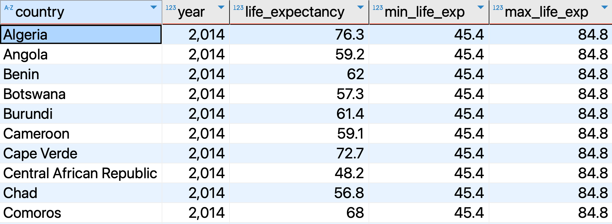
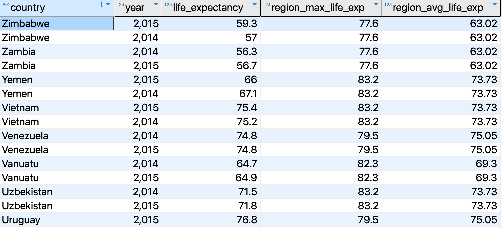
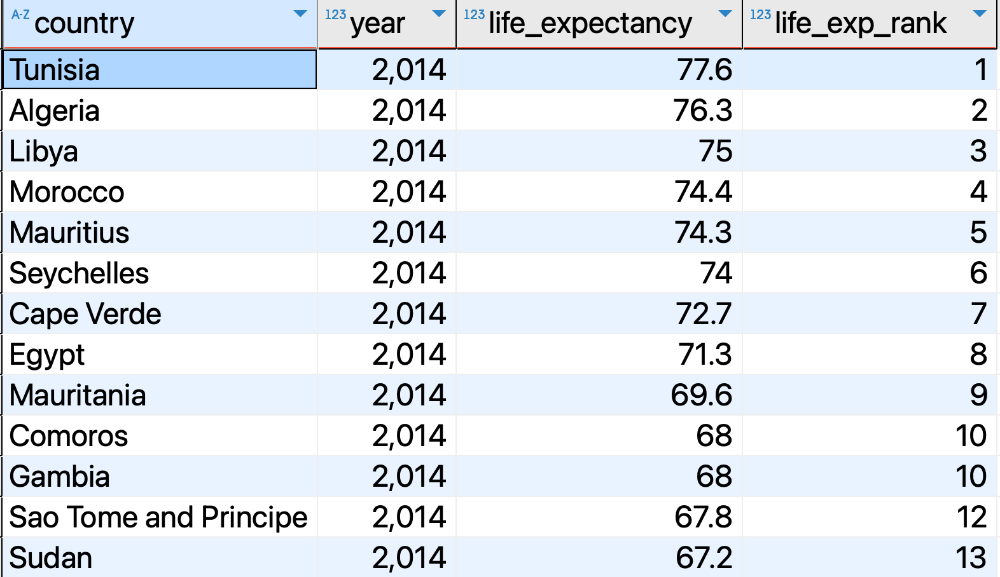
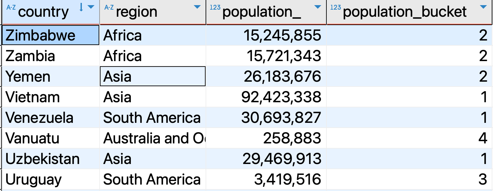
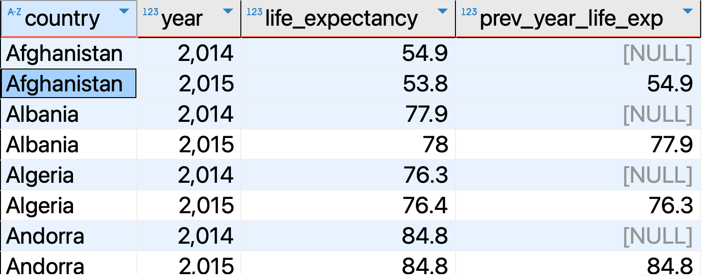
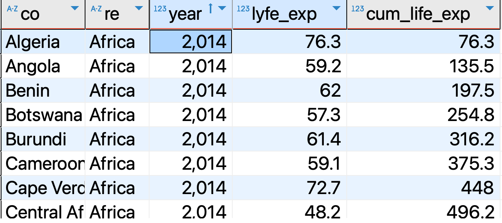
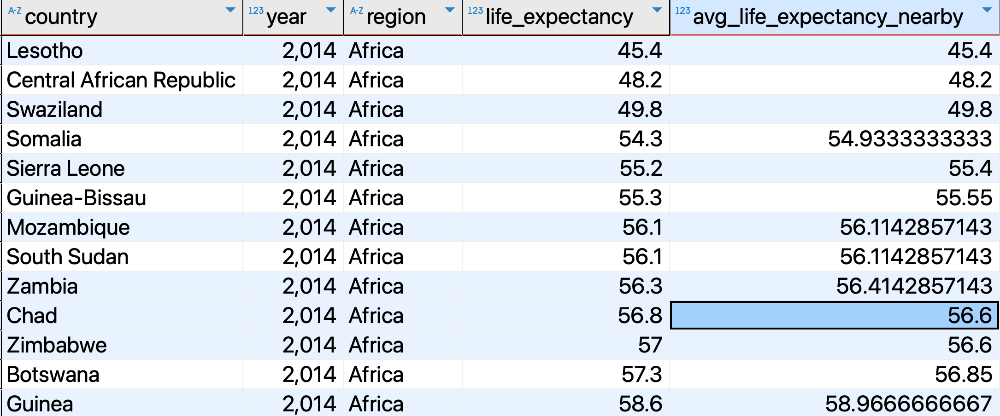

## Window Functions
In this file, we will learn **window functions**, a more advanced type of *SQL* functions that we can use to perform advanced calculations on data. Imagine we have a table with multiple rows and we want to calculate the `average`, `sum`, `lag` or `rank` of a column based on a specific set of rows (**windows**). In this case, we can use **window functions** to achieve this. 

 

## Table of Contents
- [Window Functions](#window-functions)
- [Table of Contents](#table-of-contents)
- [What is a Window Function?](#what-is-a-window-function)
  - [Different Types of Window Functions](#different-types-of-window-functions)
- [Syntax for Window Functions](#syntax-for-window-functions)
- [Window Function Examples](#window-function-examples)
  - [Using Aggregate Window Functions With No Partition](#using-aggregate-window-functions-with-no-partition)
  - [Using Aggregate Window Functions With Partition](#using-aggregate-window-functions-with-partition)
  - [Using the RANK Function](#using-the-rank-function)
  - [Using the DENSE\_RANK Function](#using-the-dense_rank-function)
  - [Using the NTILE Function](#using-the-ntile-function)
  - [Using the LAG Function](#using-the-lag-function)
- [Using the FRAME Clause in ORDER BY](#using-the-frame-clause-in-order-by)
  - [ROW BETWEEN EXAMPLE](#row-between-example)
  - [RANGE BETWEEN EXAMPLE](#range-between-example)
- [Conclusion](#conclusion)
- [Resources](#resources)


## What is a Window Function?

A **window** is basically a **set** of **rows** or **observations** in a table or in a result of a query. We can have more than one window depending on how  specify the query. As we will see later, a window is defined using the `OVER()` clause in SQL.

Therefore, **windows funtions** are SQL functions that we can use to perform operations on a set of rows in a window. In addition depending on how we define the **window**, we can partition the data into different groups.


Before we dive into the syntax of Window functions, let's have a look at the categories of window functions.

### Different Types of Window Functions

We can categorize **window functions** into three main types:

1. **Aggregate window functions**: These functions are used to perform operations on sets of rows in a window(s). They include `SUM()`, `MAX()`, `COUNT()`, and others.
2. **Ranking window functions**: These functions are used to rank rows in a window(s). They include `RANK()`, `DENSE_RANK()`, `ROW_NUMBER()`, `NTILE()` and so on.
3. **Value window functions**: These functions are like aggregate window functions that perform multiple operations in a window, but they're different from aggregate functions. They include things like `LAG()`, `LEAD()`, `FIRST_VALUE()`, and others.


## Syntax for Window Functions
A **window function** in SQL has the following syntax:

```sql
function(expression|column) OVER(
    [ PARTITION BY expr_list optional]
    [ ORDER BY order_list optional]
)
```

Let's now explain the syntax:
1. `function(expression|column)`: This is the window function such as `SUM()`, `RANK()`, `AVG()`, etc.
2. `OVER()`: This keyword specifies that the function before it is a window function not an ordinary one. It has some parameters which are optional depending on what you want to achieve.
   1. `PARTITION BY expr_list`: It divides the result into different partitions/windows. For example, if you specify the `PARTITION BY` clause by a column(s) then the result will be divided into different windows of the value of that column(s). The `expr_list` can be an expression or a column name.
   2. `ORDER BY order_list`: It is used to sort the observations in a window. The `order_list` can be an expression or column name and you can also specify the sort order (either **ascending** or **descending**), or you can sort any null values first or last.


So, the `OVER()` clause is used to tell that the **function** is a **window function** and to **specify** the window in a result. If any parameter is not specified in the `OVER()` clause, the default number of windows in the result will be one.


## Window Function Examples
Let's now see some examples of how to use window functions in SQL. We will use the `life_exp_pop` table from the `gapminder` schema. The table has columns `country`, `year`, `life_expectancy`, and `population_`.
### Using Aggregate Window Functions With No Partition
 Let's suppose we want to compare the minimum and maximum life expectancy. We can use the `MIN()` and `MAX()` **window functions** as follows:

```sql
SELECT country, year,life_expectancy,
       MIN(life_expectancy) OVER() as min_life_exp,
       MAX(life_expectancy) OVER() as max_life_exp
FROM life_exp_pop;
``` 
Let's emphasize some points in the above query:
- The `OVER` clause is used to specify that the `MIN()` and `MAX()` functions are window functions.
- The `PARTITION BY` and `ORDER BY` clauses are not specified in the `OVER()` clause. Therefore, the result will be **one window** that spans the entire dataset.
- The result will be not aggregated but will be shown in each row even though we used **aggregate functions** as window functions.

<p align="center">
<div style="display: inline-block; background-color: violet; padding: 10px; border-radius: 5px;\">
  
</div>
    <br>
    <em style="display: block; text-align: center;">Min Max</em>
</p>

Note also that the above query can be also achieved using subqueries like this:

```sql
SELECT country, year, life_expectancy,
       (SELECT MIN(life_expectancy) FROM life_exp_pop) as min_life_exp,
       (SELECT MAX(life_expectancy) FROM life_exp_pop) as max_life_exp
FROM life_exp_pop;
```
As you can see, the **window function** makes the query **more readable** and **easier** to **understand** compared to the subquery method. 

### Using Aggregate Window Functions With Partition
Let's suppose we want to split the dataset into different **partitions/groups**. Then we want to compare each observation in each **partition** with an aggregate value or a calculated value of each partition. We can use the `PARTITION BY` clause in the `OVER` function.

For example, let's compare the maximum and average life expectancy in each region with the individual life expectancy of each country. We can do this by specifying the `PARTITION BY` clause in the `OVER` statement and also use it with the aggregate function we want to use to achieve our desired result.

```sql
SELECT country, year, life_expectancy,
         MAX(life_expectancy) OVER(PARTITION BY region) as region_max_life_exp,
         ROUND(AVG(life_expectancy) OVER(PARTITION BY region), 2) as region_avg_life_exp
FROM life_exp_pop;
```

In the above query:
1. The `PARTITION BY region` clause specified in the `OVER()` clause splits the result into 6 different partitions. This is because there are 6 different regions in the `region` column (**Africa**, **Australia and Oceania**, **Asia**, **South America**, **North America**, **Europe**).
2. After the `PARTITION BY` clause, we then calculate the aggregate function for each record in the different regions.

<p align="center">
<div style="display: inline-block; background-color: violet; padding: 10px; border-radius: 5px;\">
  
</div>
    <br>
    <em style="display: block; text-align: center;">Partition By</em>

### Using the RANK Function
The `RANK()` function, as the name implies, ranks the observations in a window but  . Let's see how it works:

```sql
SELECT country, year, life_expectancy,
       RANK() OVER(PARTITION BY region, year ORDER BY life_expectancy DESC) as life_exp_rank
FROM life_exp_pop;
```
In the above query:
- The `RANK()` function is used to rank the observations in the window.
- The `PARTITION BY region, year` clause splits the result into different partitions based on the `region` and `year` columns.
- The `ORDER BY life_expectancy DESC` clause sorts the observations in each partition by `life_expectancy` in descending order.

It is worth to mention that the `RANK()` function assigns the same rank to rows with the same value. For example, if two countries have the same life expectancy , they will have the same rank, as shown in the image below where **Comoros** and **Gambia** are both ranked 10th. The next rank will be skipped. In fact, the country **Sao Tome and Principe** is ranked 12th instead of 11th.
<p align="center">
<div style="display: inline-block; background-color: violet; padding: 10px; border-radius: 5px;\">
  
</div>
    <br>
    <em style="display: block; text-align: center;">Rank Function</em>
</p>

### Using the DENSE_RANK Function

In case we don't want to skip the next rank when there is a tie, we can use the `DENSE_RANK()` function. This function works similarly to the `RANK()` function:

```sql
SELECT country, year, life_expectancy,
       DENSE_RANK() OVER(PARTITION BY region, year ORDER BY life_expectancy DESC) as life_exp_rank
FROM life_exp_pop;
```

### Using the NTILE Function
With the `NTILE()` function, we can divide the result into a specified number of groups or buckets, that have approximately the same number of data points/observations/rows. It is useful when we want to divide the data into quantiles or percentiles.
The `NTILE()` function assigns a bucket number to each row in a window. The number of buckets is specified as an argument to the `NTILE()` function. For example, if we specify `NTILE(4)`, the result will be divided into 4 buckets.

Let's see an example of how to use the `NTILE()` function to divide the data into 4 buckets (quartile) based on population size for the year 2014:


```sql
SELECT country, year, life_expectancy, population_,
       NTILE(4) OVER(PARTITION BY year ORDER BY population_ DESC) as population_bucket
FROM life_exp_pop
WHERE year = 2014;
```
In the above query:
- The `NTILE(4)` function divides the data into quartiles based on the `population_` column.
- The `PARTITION BY year` clause splits the data into different partitions based on the `year` column.
- The `ORDER BY population_` clause orders the data by the `population_` column.

<p align="center">
<div style="display: inline-block; background-color: violet; padding: 10px; border-radius: 5px;\">
   
</div>
    <br>
    <em style="display: block; text-align: center;">Ntile Function</em> 
</p>

As shown in the image, each country is assigned a bucket number based on the population size. The countries with the largest population are assigned to bucket 1, the next largest to bucket 2, and so on. The countries with the smallest population are assigned to bucket 4. For instance, `Zimbabwe` and `Yemen` with a a population of about 16 million and 26 million belong to the 2th bucket/quartile. 

### Using the LAG Function
In case you need to compare the value of a **previous row** with the **current row** in a window, you can use the `LAG()` function. The `LAG()` function returns the offset row before the current row within a window. By default, it returns the previous row before the current row. If there is no previous row, it returns `NULL`. It is commoly used in time-series analysis.

```sql
LAG(value_expression, offset, default) OVER (
    [PARTITION BY partition_expression, ...]
    ORDER BY sort_expression [ASC | DESC], ...
)
```
The `LAG()` function has the following parameters:
- `value_expression`: The column or expression to evaluate.
- `offset`: The number of rows before the current row to return. The default is 1.
- `default`: The value to return if the offset row does not exist. The default is `NULL`.

Let's suppose we want to compare the life expectancy of each country with the previous year's life expectancy. We can use the `LAG()` function as follows:

```sql
SELECT country, year, life_expectancy,
       LAG(life_expectancy) OVER(PARTITION BY country ORDER BY year) as prev_year_life_exp
FROM life_exp_pop;
```
The **output** is shown below:
<p align="center">
<div style="display: inline-block; background-color: violet; padding: 10px; border-radius: 5px;\">
  
</div>
  <br>
  <em style="display: block; text-align: center;">Lag Function</em>
</p>

As shown in the image, the **first record** in **each partition**, which is the **first record** in **each country**, does not have a previous value, so `NULL` is returned in the `prev_year_life_exp`. The next record has a previous record, so it returns the previous value.

## Using the FRAME Clause in ORDER BY

As the name suggests, the **frame clause** provides the **set of rows in a window**, on which a window function is applied. This means that we can **specify how many rows before or after** the current row we want to include in the calculation.

The **frame clause** cannot be used with ranking functions. It is normally used with **aggregate functions**. In fact, you can calculate the **cumulative sum**, **moving average**, **running total**, and so on using the **frame clause**.

The **frame clause** itself has several components:
```sql
{ROWS | RANGE | GROUPS} BETWEEN {START_POINT} AND {END_POINT}
```
- `ROWS` clause defines the frame in terms of physical rows from the current row. That is, it is used to specify the rows that will be used in conjunction with the current row for calculation.
- `RANGE` defines the frame in terms of the logical value
- `GROUPS` works similar to `RANGE` but it extend the window to other groups.
- `START_POINT` and `END_POINT` specify the rows that will be used in conjunction with the current row for calculation. They can be:
  - `N PRECEDING`: The frame includes N rows before the current row.
  - `N FOLLOWING`: The frame includes N rows after the current row.
  - `UNBOUNDED PRECEDING`: The frame includes all rows before the current row within the partition.
  - `UNBOUNDED FOLLOWING`: The frame includes all rows after the current row within the partition.
  - `CURRENT ROW`: The frame includes the current row.

### ROW BETWEEN EXAMPLE
Suppose we want to calculate the **cumulative sum** of the life expectancy for each region. We can use the `ROWS BETWEEN` clause as follows:

```sql
SELECT country AS co, year, life_expectancy AS lyfe_exp,
       SUM(life_expectancy) OVER(PARTITION BY region, year ORDER BY year ROWS BETWEEN UNBOUNDED PRECEDING AND CURRENT ROW) AS cum_life_exp
FROM life_exp_pop;
```
In the above query:
- The `PARTITION BY region, year` ensure that the calculation is done for each region and year. This means that the cumulative sum is calculated for each region and year.
- The `ORDER BY year` clause orders the data by year.
- The `ROWS BETWEEN UNBOUNDED PRECEDING AND CURRENT ROW` clause specifies that the frame includes all rows before the current row and the current row itself.
- The `SUM()` function calculates the cumulative sum of the life expectancy for each region.

The **output** is shown below:
<p align="center">
<div style="display: inline-block; background-color: violet; padding: 10px; border-radius: 5px;\">
  
</div>
  <br>
  <em style="display: block; text-align: center;">Rows Between</em>
</p>

In the image, Algeria's life expectancy of 76.3 years is the first entry in the cumulative column. For Angola, the cumulative life expectancy is the sum of Algeria's life expectancy (76.3) and Angola's life expectancy (59.2), resulting in 135.5, and so on down the list. This calculation is done for each region and year.

### RANGE BETWEEN EXAMPLE
Let's consider another example using the `RANGE BETWEEN` clause. Suppose we want to calculate an average life expectancy within a numerical range for each country, partitioned by both year and region. 

```sql
SELECT country, region, life_expectancy, 
  AVG(life_expectancy) OVER (
    PARTITION BY year, region 
    ORDER BY life_expectancy
    -- The frame clause specifies the range between 1 preceding and 1 following
    RANGE BETWEEN 1 PRECEDING AND 1 FOLLOWING
  ) AS avg_life_expectancy_nearby
FROM 
  life_exp_pop
WHERE 
  YEAR = 2014;
```

The output is shown below:
<p align="center">
<div style="display: inline-block; background-color: violet; padding: 10px; border-radius: 5px;\">
  
</div>
    <br>
    <em style="display: block; text-align: center;">Range Between</em>  
    

The average life expectancy calculated in the last column is determined by considering the life expectancy values of countries that fall within a specified range relative to the current row's life expectancy. 

Let's consider Mozambique as an example.
It's life expectancy is 56.1 years for the year 2014. 
Any country with a life expectancy between 55.1 and 57.1 years will be included in the calculation of the average life expectancy for Mozambique.
The country are **Sierra Leone** (55.2),**Guinea-Bissau** (55.3), **Mozambique** and **South Sudan** (56.1), **Zambia** (56.3) and **Zimbabwe** (57). The average life expectancy for these countries is 56.1 years. 
## Conclusion   

In this file, we have learned about **window functions** in SQL. We have seen that **window functions** are used to perform operations on a set of rows in a window. We have also seen the different types of **window functions** such as **aggregate**, **ranking**, and **value** functions. We have learned the syntax of **window functions** and how to use them in SQL queries.

## Resources
- [PostgreSQL Documentation on Window Functions](https://www.postgresql.org/docs/current/tutorial-window.html)
- [GeekforGeeks: Window Functions in SQL](https://www.geeksforgeeks.org/window-functions-in-sql/)