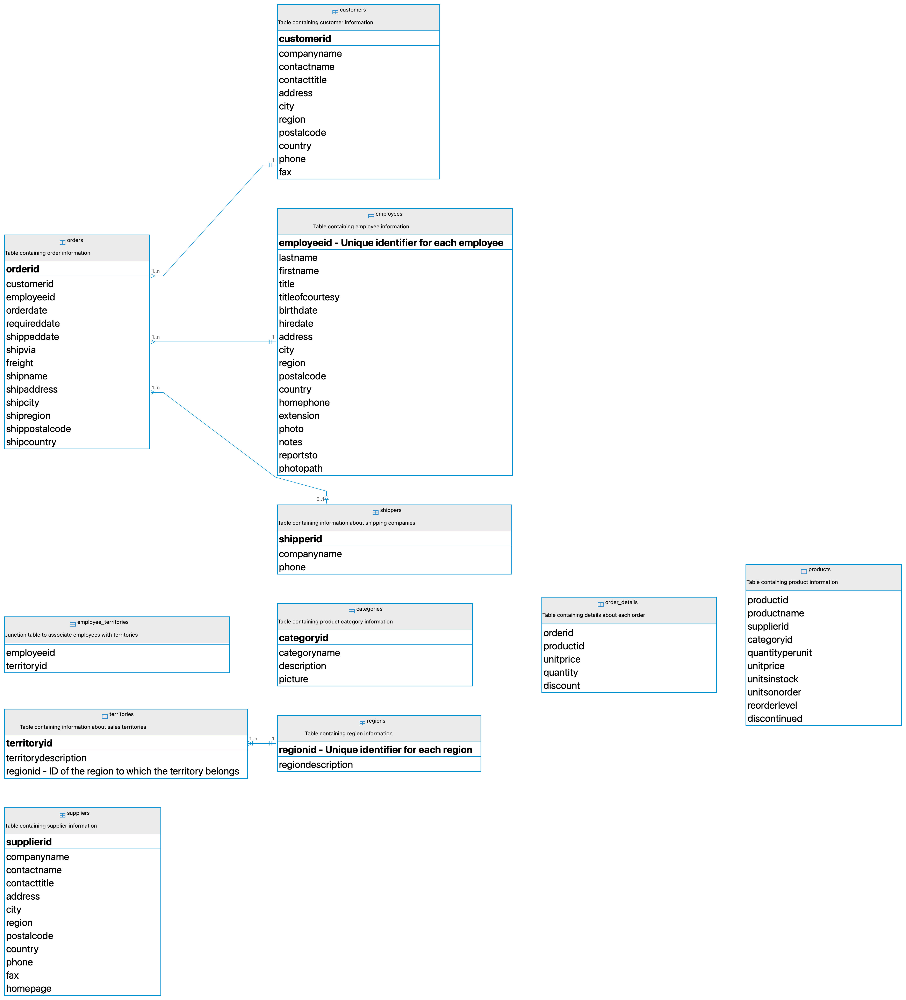

# Analyze the Northwind Dataset
In this exercise, you will analyze the `Northwind` dataset using SQL queries. The `Northwind` dataset is a sample database used by Microsoft for tutorials and examples. It contains tables for products, orders, customers, employees, and more. 

   

     
    <em style="display: block; text-align: center;">Northwind Data</em> 

## Instructions
1. Connect to the `northwind` schema in the database using DBeaver.
2. Write SQL queries to answer the following questions:
    - Get the names and the quantities in stock for each product.
    - Get a list of customers who are located in 'Germany'.
    - Calculate the average days to ship
    - Get a list of current products (Product ID and name).
    - Get a list of the most and least expensive products (name and unit price).
    - Get products that cost less than $20.
    - Get products that cost between $15 and $25
    - Find the products with prices above the average price.
    - Find the ten most expensive products
    - Get a list of discontinued products (Product ID and name).
    - Count current and discontinued products.
    - Find products with less units in stock than the quantity on order.
    - Find the customer who had the highest order amount.
    - Get orders for a given employee and the according customer.
    - Find the hiring age of each employee
    - Get number of customers in each city
    - Find the total number of orders placed by each customer.
    - Get the average price of products for each category.
    - Get a list of employees and their assigned territories.
    - Get the orders that contain products in the 'Beverages' category.
    - Get the total number of orders placed in the year 1997.
    - Find products ordered the most.
    - Find customers who ordered products in more than one category.
    - Generate a summary report for each product category showing the total quantity sold, total sales, and number of orders.
    - Rank employees based on their total sales.
    - Calculate running total sales per order.
    - Find the difference in sales between each order and the previous order
    - Find the total sales per product and then get the top 5 selling products

3. Save your queries in a `.sql` file.

## Resources
[EXTRACT() : Function to extract time related fields](https://www.postgresql.org/docs/current/functions-datetime.html)
