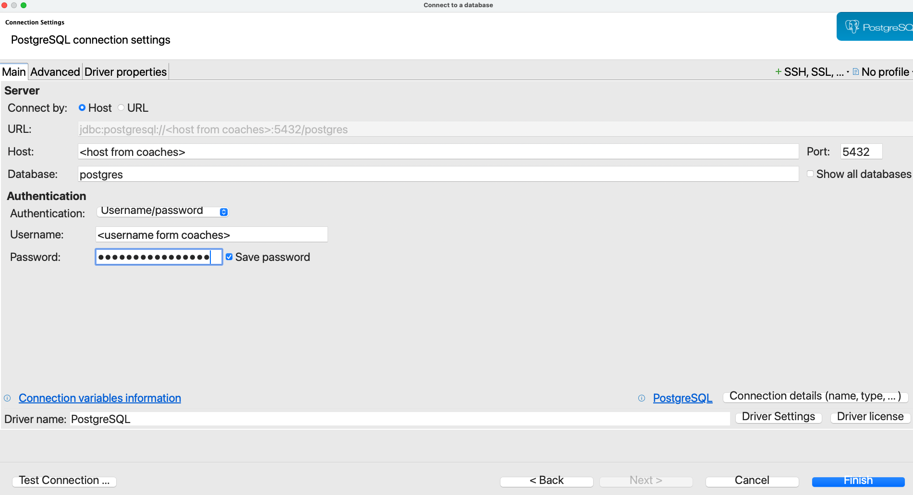
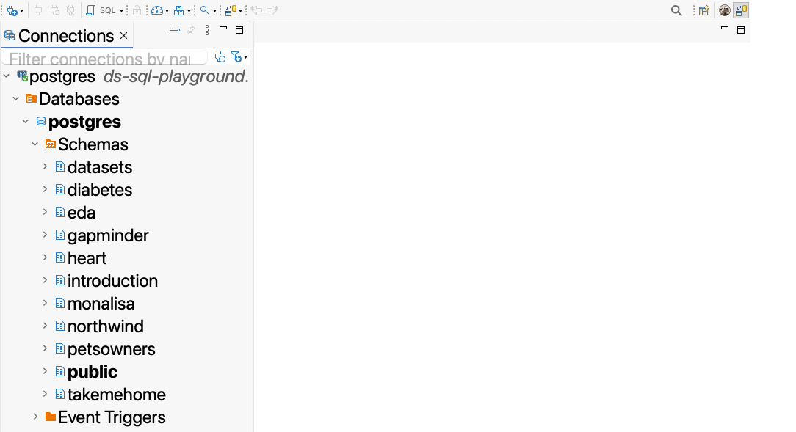

# Database Connection

All lessons and exercises in this repository run against a shared, AWS-hosted PostgreSQL database. You connect to it with DBeaver, the database client you already have installed. Follow these steps once before starting the lessons.

## 1. Create a PostgreSQL connection

Open DBeaver and click the **new connection** icon (the plug with a plus). Select **PostgreSQL**, then fill in the connection details:

- **Host**
- **Database**
- **User**
- **Password**
- **Port**

The credentials are shared with you by the coaches. Click **Test Connection**. If DBeaver offers to download a driver, accept it.

> [!CAUTION]
> These credentials are secrets. Never paste them into your SQL scripts, commit them to the repository, or share them publicly.

A successful configuration looks like this:



## 2. Open a SQL editor and set the schema

In the left panel, expand your connection down to **postgres → databases → postgres → schemas**.



Right-click the schema you need, then choose **SQL Editor → New SQL script**. Set the active schema at the top of every script, and run statements with **Ctrl + Enter**.

The lessons use the `gapminder` schema:

```sql
SET SCHEMA 'gapminder';
```


You are now ready to begin with [1 - CASE WHEN](1_case_when.md).

Once the Northwind exercises begin in Lesson 4, you will need to switch to the `northwind` schema. You can have multiple SQL editors open at once, so feel free to keep one editor with the `gapminder` schema active for reference while you work on the Northwind exercises.


```sql
SET SCHEMA 'northwind';
```